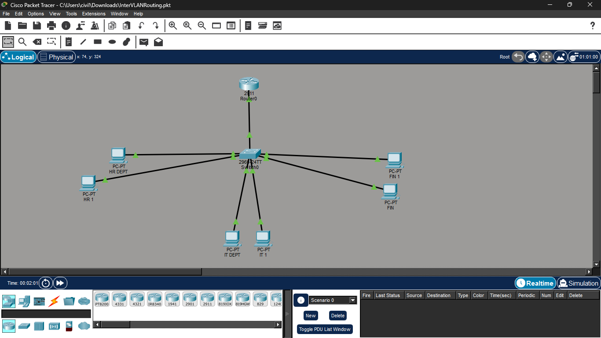
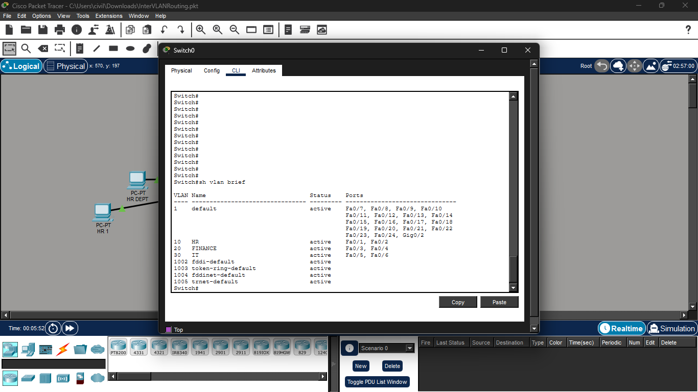
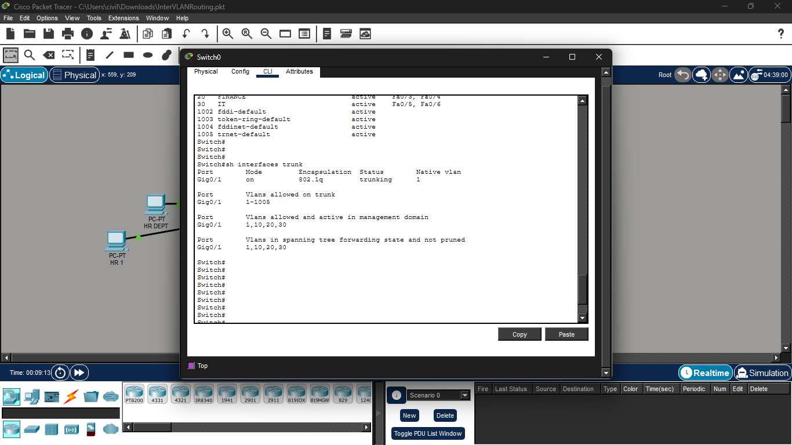
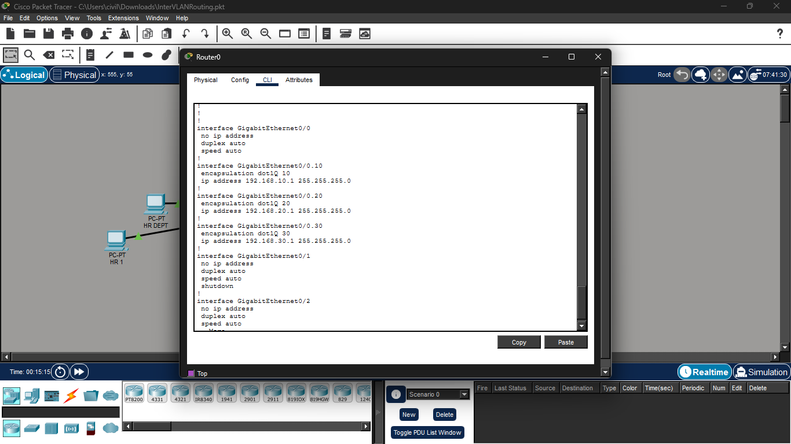
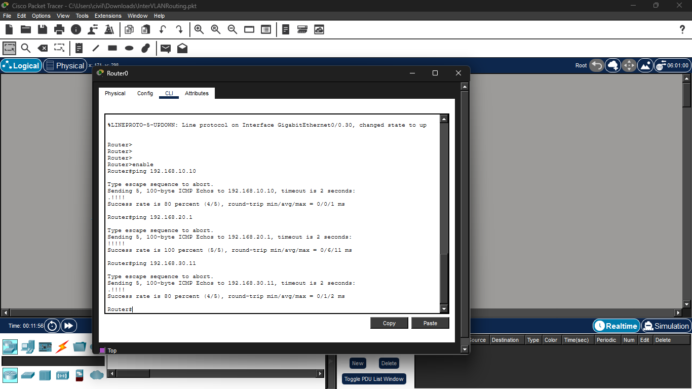

# Cisco Packet Tracer - Inter-VLAN Routing (Router-on-a-Stick)

## Project Overview

This project demonstrates VLAN segmentation, trunking, and Inter-VLAN Routing using the Router-on-a-Stick technique in Cisco Packet Tracer.

## Network Topology

- Router: Cisco 2911
- Switch: Cisco 2960
- VLAN 10 - HR Department
- VLAN 20 - Finance Department
- VLAN 30 - IT Department

## IP Addressing

| VLAN | Department | Network | Gateway |
|------|------------|---------|---------|
|10|HR|192.168.10.0/24|192.168.10.1|
|20|Finance|192.168.20.0/24|192.168.20.1|
|30|IT|192.168.30.0/24|192.168.30.1|

## Technologies Used

- Cisco Packet Tracer
- VLAN Configuration
- IEEE 802.1Q Trunking
- Router-on-a-Stick
- Static IP Addressing
- Inter-VLAN Routing

## Commands Used

### Switch

```bash
show vlan brief
show interfaces trunk
show mac address-table dynamic
```

### Router

```bash
show ip interface brief
show ip route
```

## Project Screenshots

### Network Topology



### VLAN Configuration



### Trunk Configuration



### Router Configuration



### Inter-VLAN Ping Test



## Skills Demonstrated

- VLAN Creation
- Switch Port Assignment
- Trunk Configuration
- Router Subinterface Configuration
- Inter-VLAN Routing
- Network Troubleshooting
- Cisco IOS CLI

## Author

**Asawari Kale**

Computer Engineering Student

Mumbai University

Interested in Networking & Cyber Security
